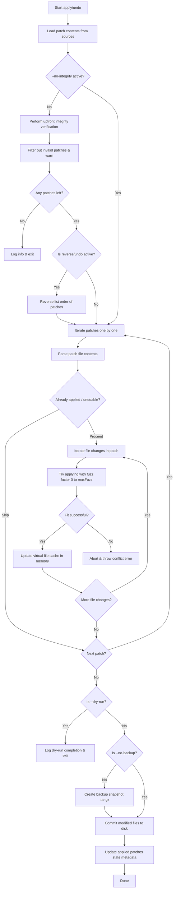

# Apply / Undo Command (`apply.js`)

The `apply` and `undo` commands load patch files or URLs, check their integrity, dry-run their application in-memory, create backup snapshots, and atomically apply changes to files.

## Usage

```bash
ptero-patch apply <file-or-url-or-dir> [options]
# OR
ptero-patch undo <file-or-url-or-dir> [options]
```

### Options

*   **`-d, --dir <path>`**: The target project directory.
*   **`--dry-run`**: Simulates the patch application process without writing any changes to disk.
*   **`--no-backup`**: Bypasses the creation of a `.tar.gz` backup snapshot before writing changes.
*   **`-R, --reverse`**: Applies the patches in reverse order (active by default for `undo`).
*   **`--force`**: Forces application of already applied patches, or removal of non-applied patches.
*   **`--no-fuzzy`**: Disables fuzzy matching (forces fuzz factor `0`).
*   **`--no-integrity`**: Disables upfront filename-content hash validation.
*   **`-f, --fuzz <number>`**: Sets the maximum fuzz factor (default: `3`).

---

## Transactional / Atomic Safeguard

To prevent partial code updates, file writes are fully decoupled from patch evaluation:
1. **In-Memory Dry Run**: All patch modifications are simulated within an in-memory cache first.
2. **Aborts on Failure**: If any hunk in any patch fails to apply (even with maximum fuzz), a conflict error is thrown, and the process exits instantly. **No files on disk are touched.**
3. **Backup**: If successful, a backup archive of the original files is created.
4. **Write**: The patched files are written to disk, and the state metadata is saved.

---

## Workflow Flowchart


