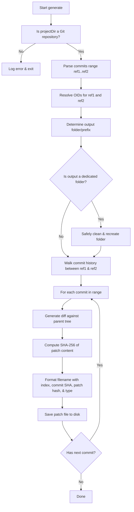

# Generate Command (`generate.js`)

The `generate` command compares a range of Git commits in the target repository, calculates diffs, and outputs them as sequentially numbered, formatted patch files.

## Usage

```bash
ptero-patch generate --commits <commit1>..<commit2> [options]
```

### Options

*   **`-c, --commits <range>`**: (Required) The commit range (e.g. `HEAD~3..HEAD`).
*   **`-d, --dir <path>`**: The path to the Git repository.
*   **`-o, --output <path>`**: The output folder or filename prefix where patches are saved.

---

## Filename Format

Patch files are named according to a strict pattern:
`[sequence]-[commitHash]-[patchHash]-[NEW|MOD].patch`

*   **`sequence`**: A zero-padded 4-digit index (e.g., `0001`).
*   **`commitHash`**: The first 8 characters of the source Git commit SHA.
*   **`patchHash`**: The first 8 characters of the SHA-256 hash of the patch file content (for integrity validation).
*   **`NEW|MOD`**: Identifies whether the patch introduces new files (`NEW`) or modifies existing ones (`MOD`).

---

## Workflow Flowchart


