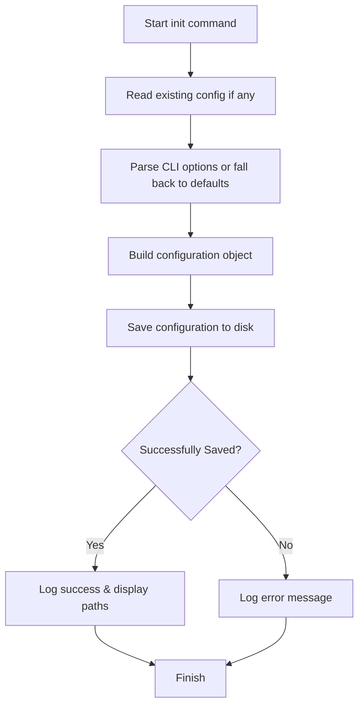

# Init Command (`init.js`)

The `init` command initializes the configuration file for the `Ptero-Diff-Patcher` CLI. It configures and stores default directory paths for the project, patch outputs, and snapshot backups.

## Usage

```bash
ptero-patch init [options]
```

### Options

*   **`-p, --project-dir <path>`**: The path to the root directory of the Pterodactyl project (defaults to the current working directory).
*   **`-b, --backup-dir <path>`**: The folder path where backup/snapshot archives (`.tar.gz`) are saved.
*   **`-d, --patches-dir <path>`**: The default folder where patch files are generated and stored.

---

## Workflow Flowchart


