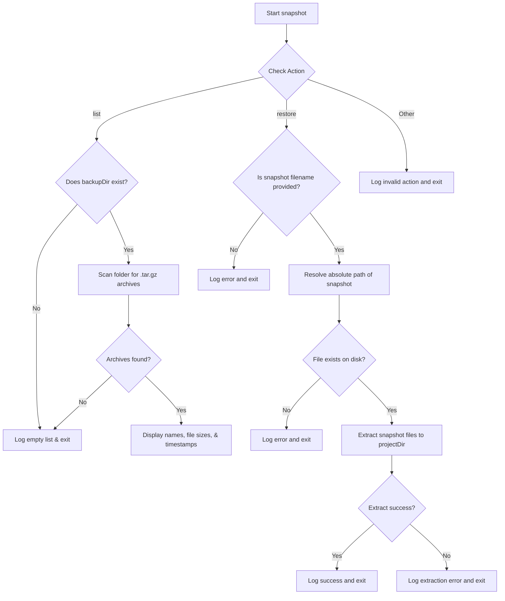

# Snapshot Command (`snapshot.js`)

The `snapshot` command manages backup snapshots of the project directory. It allows listing available backups and restoring files to a specific snapshot state.

## Actions

### 1. List Snapshots

Lists all available backup archives (`.tar.gz`) stored in the configured backup directory, along with file sizes and creation dates.

```bash
ptero-patch snapshot list
```

### 2. Restore Snapshot

Extracts a specific backup archive and restores the files back into the project directory, overwriting current modified versions.

```bash
ptero-patch snapshot restore <snapshot-name>
```

---

## Workflow Flowchart


